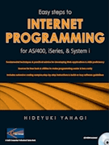

{: align="center"}
**Welcome!**
to the UZAEMON's homepage. All of the programs found here run on IBM AS/400, iSeries, System i and IBM i. They are open-source and free for personal and commercial use. **Never ask IBM about these programs!**

{: align="center"}
**ようこそ!**
UZAEMONのホームページへ。
こちらではIBM i (System i, iSeries, AS/400)用のオープンソース・ソフトウェアを掲載/紹介します。
**内容に関して日本IBMを含むIBM社はまったく関知するものではありませんので、お問い合わせなどはなさらないでください。**

{: align="center"}
[[What's new]](#whats-new) 
[[History]](history.html)
[[My Book]](#my-book) 
[[Download]](#download)
[[Documents]](#documents)
[[Links]](#links)
[[BBS (Archive)]](oldBBS/index.html)

---

## [What's new](#whats-new)  
2024/05/08

2点更新しました。

- アイマガジン掲載記事のコードを公開しました。記事そのものはバックナンバー(まだあれば...)をご覧ください。
  - iMagazine 2015.05 「iのスゴ技ウラ技 第2回」より、[スプールファイルの簡易なExcel取り込み](https://github.com/uzaemon/homepage/tree/main/SPL2EXCEL)
  - iMagazine 2016 Spring 「iのスゴ技ウラ技 第4回」より、[ILE RPGプログラムによる文字列の暗号化](https://github.com/uzaemon/homepage/tree/main/CRYPTO)

- 自作プログラム(Analogやzlibなど移植系以外)のソースコードをGitHubで直接見られるようにしました。
  - CRTCSVF：https://github.com/uzaemon/homepage/tree/main/CSV
  - SPL2STMF：https://github.com/uzaemon/homepage/tree/main/HPT
  - RCVM：https://github.com/uzaemon/homepage/tree/main/POP3
  - SNDM：https://github.com/uzaemon/homepage/tree/main/SMTP

SNDMの最終版1-36は2003-05-05作成なので、20年以上たっているのですね...しみじみ。

[[過去の投稿]](history.html)

---

## [My Book](#my-book)

[&quot;Easy Steps to Internet Programming for AS/400, iSeries, and System i&quot;](iptu/index.html)

{: align="center"}

- [Book follow-up page](iptu/index.html) (full table of contents, excerpts, corrections, etc.)
- [Publisher's site](http://www.itjungle.com/) (ITJungle)

---

## [Download](#download)

**THE SOFTWARE IS PROVIDED &quot;AS-IS&quot; AND WITHOUT WARRANTY OF ANY
KIND, EXPRESS, IMPLIED OR OTHERWISE, INCLUDING WITHOUT LIMITATION, ANY
WARRANTY OF MERCHANTABILITY OR FITNESS FOR A PARTICULAR PURPOSE.**

! Read before you start !

- My current test bed is OS/400 **V5R2** and I am using utilities on the machine.
  - Analog and wcount **MAY** work on V4R2 or later.
  - zlib, TIFF2PDF, SPL2STMF, SNDM and CRTCSVF **MAY** work on V3R7 or later.
    - &quot;tifflib.exe&quot;has been saved specifying V4R5 as target release.
      All new functions (paper size, etc.) are available only by using &quot;tifflib.exe&quot;.
      &quot;tifflib_old.exe&quot; has been saved specifying V3R2 as target release.
    - &quot;hpt_520.exe&quot;has been saved specifying V4R5 as target release.
      If you are using V5R2 (with latest PTF level), you need to use &quot;hpt_520.exe&quot;.
      &quot;hpt_510.exe&quot; has been saved specifying V3R2 as target release.
  - RCVM **MAY** work with JVM 1.1.8 or later if you don't use UTF-16LE. JVM 1.3 and OS/400
    V5R1 or later are recommended.
- Most utilites are distributed without executables. You need ILE or Java
  compiler to use utilities.
- To compile the utilities, IBM supplied library **QSYSINC** is required.

|Utility|description|library|language|download|documents|link to homepage|
|-------|-----------|-------|--------|--------|---------|----------------|
|Analog|World's most popular HTTP access log analysis tool.|ANALOG|ILE-C/CL|[4.11](analog411.exe)|[install](analog_install.html) [usage](analog_usage.html) [license](analog_license.html)  [Perl install](perl_install.html)|[Analog: WWW logfile analysis](https://analog.readthedocs.io/en/latest/)
|wcount|Web graphical access counter and clock.|WCOUNT|ILE-C|[2.5](wcount25.exe)|[install](wcount_install.html) [usage](wcount_usage.html) [license](wcount_license.html)|[WWW Homepage Access Counter and Clock](http://www.muquit.com/muquit/software/Count/Count.html)|
|zlib|Command line zip/unzip utility for OS/400.|ZLIB|ILE-C|[1.2.3](zlib123.exe)  [1.1.3 (old)](zlib.exe)|[install](zlib_usage.html) [license](zlib_license.html) [addendum](zlib_addendum.html)|[zlib Home Site](http://www.zlib.net/) [Minizip: Zip and UnZip additionnal library](http://www.winimage.com/zLibDll/minizip.html)|
|libtiff (and TIFF2PDF)|Converts TIFF image file to Adobe PDF(Acrobat). Can be used with SPL2STMF to convert AFP spooled file to PDF.|TIFFLIB|ILE-C|[tifflib.exe](tifflib.exe) [tifflib_old.exe](tifflib_old.exe)|[install](tifflib_install.html) [usage](tifflib_usage.html) [license](tifflib_license.html)|[LibTIFF - TIFF Library and Utilities](http://www.libtiff.org/) (Original TIFF2PDF.C is no longer available on the Web)|
|SPL2STMF|Converts OS/400 spooled file(SCS/AFP) to PC stream file(text/PCL/TIFF/etc.).|HPT|ILE-RPG|[(GitHub)](https://github.com/uzaemon/homepage/tree/main/HPT) [0.04(hpt_520)](hpt_520.exe) [0.03(hpt510)](hpt_510.exe)|[install](hpt_install.html) [usage](hpt_usage.html) [license](hpt_license.html)|(This site)|
|SNDM|Sends Internet mail from OS/400 command line. You don't need to configure  your AS/400 or iSeries as mail server. Supports various languages (US-ASCII/ISO-8859-1[French, German, etc.]/ISO-2022-JP[Japanese]) and attachment files.|SMTP|ILE-RPG|[(GitHub)](https://github.com/uzaemon/homepage/tree/main/SMTP) [1-36](smtp136.exe)|[install](sndm_install.html) [usage](sndm_usage.html) [license](sndm_license.html) [Latin-1 support](iso8859.html)|(This site)|
|RCVM|Receives Internet mail from POP3 server. Based on JavaMail API. May runs on OS/400, Windows and other JVM.|POP3|ILE-CL/Java|[(GitHub)](https://github.com/uzaemon/homepage/tree/main/POP3) [0.6](pop3.exe)|[install](rcvm_install.html) [usage](rcvm_usage.html) [license](rcvm_license.html)|(This site)|
|CRTCSVF|Converts DB2/400 to CSV(Comma Separated Values) format PC stream file. Generates small and highly compatible CSV file.|CSV|ILE-RPG/CL|[(GitHub)](https://github.com/uzaemon/homepage/tree/main/CSV) [2-15](CSV.EXE)  [Old (2-14)](CSV_2-14.EXE)|[install](crtcsvf_install.html) [usage](crtcsvf_usage.html) [license](crtcsvf_license.html)|(This site)|

---

## [Documents](#documents)

- [全ての始まり](HowItAllBeganJ.html) 'How It All Began' by Wayne O. Evans
- [AFP印刷アプリケーションのサンプル](afpprt.html) AFP list application example

---

## [Links](#links)

_English_

- [IT Jungle Homepage](http://www.itjungle.com/)
- [System iNetwork (formerly, iSeries Network or News/400)](http://systeminetwork.com/">http://systeminetwork.com/)
- [iSeries Freeware, Shareware, and Public Domain Software](http://www2.systeminetwork.com/code/shareware/)
- [MCPress Online (Midrange Computing Magazine)](http://mcpressonline.com/)
- [Porting Central](http://www-03.ibm.com/servers/enable/site/porting/iseries/overview/go.html)
- [Digit Mania](http://digitmania.birdbrain.net/)
- [www.perl.com](http://www.perl.com/)
- [CPAN/ports IBM OS/400](http://www.cpan.org/ports/#os400)
- [TIFF File Format](http://www.awaresystems.be/imaging/tiff.html)

_Japanese_

- [AdobeのPDFについて](http://www.adobe.co.jp/products/acrobat/adobepdf.html)
- [日本IBMのIBM i 技術情報](https://www.ibm.com/support/pages/ibm-i-%E6%8A%80%E8%A1%93%E6%83%85%E5%A0%B1)
