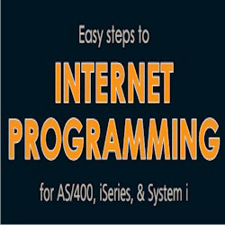

{: align="center"}

[<A href="#contents">Contents</A>] 
[<A href="#accompanying-cd-rom">Accompanying CD-ROM</A>] 
[<A href="#excerpts">Excerpts</A>] 

---

## [Contents](#contents)

Table of Contents and Figures, Tables, Lists, and Documents -&gt; [TOC.pdf](TOC.pdf)

Below is description of the book.

### Book Description

In recent years, Web technology has become so popular that people use the
Web to search information, reserve tickets, bid for an item on an
online auction, and so on. Quite a number of companies utilize the Web
not only for the Internet but also Intranet and Extranet. The same
applies to companies that use OS/400 as their enterprise system. Users
and programmers can benefit from Web technologies as they add new
capability to OS/400 applications. OS/400 itself has been capable to
run TCP/IP and Web server for years. V3R1 (OS/400 grew out of S/38 at
this version, in my opinion) introduced ILE (Integrated Language
Environment) and IFS (Integrated File System). It would be fair to say
that most OS/400s in existence are quite "Web ready" because HTTP
server (V3R2/7), Native Java (V4R2) and other Web technologies are
already available and bundled with OS/400 at no extra charge.

However, in OS/400 (and 5250) based companies, migration to Web applications
have been somewhat unfamiliar because of several reasons. For instance,
5250 interface is good enough, OS/400 programmers are not used to Web
programming, and other factors (slow communication infrastructure,
additional investment required to run a Web application server,
availability of Web-based packages and development tools, and so on)

Regardless of these factors, Web applications are steadily spreading among
midrange customers. In addition, there are factors pushing OS/400 shops
to the Web. such as improved productivity through Web-based software
packages and development tools, adequately resourced computing
environments relating to high performance hardware at affordable cost,
high-speed bandwidth, remote access by cell phone or xDLS, and freedom
from the costly 5250 interactive feature.

OS/400 does not force the either/or situation to customers. It is popular to
use core 5250 applications untouched and develop new applications using
Web technologies or migrate applications to Web interface step-by-step,
rather than all at once. Apparently, the 5250 interface will not go out
disappear as long as OS/400 exists. System operators and experienced
programmers may continue to work with the 5250 interface far into the
future. In the meantime, however, main applications are migrating to
Web interface.

Though there is no doubt that the Web is the primary way to go, Each company
should formulate a long-term blueprint on their IT roadmap. IT and
business are inseparably related. In other words, a company must
establish its strategy based on considering future criteria and
objectives for both areas.

This book is written as first step guide for those who consider building Web
applications on their OS/400. It introduces the basic concepts of
various Web technologies, OS/400 adaptation of the technologies, sample
code (from "Hello World" to practical fast to deploy applications) and
plenty of programming tips. Advanced topics that are not covered by
this book can be found in the Web site introduced in this book. The
examples are designed to work in most environments by exploiting
base-functions of operating systems and free tools downloadable from
the Internet.

### Contents

<dl>
<dt>Chapter 1. Getting Started</dt>

<dd>
This chapter introduces basic concept of the Internet and TCP/IP. The
chapter quickly goes through the TCP/IP capability of OS/400 and covers
the minimum configurations to utilizing OS/400 as a Web server.
</dd>

<dt>Chapter 2. CGI Programming</dt>

<dd>
Common Gateway Interface (CGI) is the most popular way to provide dynamic Web
application. You will learn how to create simple ITEM Query CGI
programs written in ILE-RPG/COBOL/C. Also, I take an in-depth look at
CGI mechanisms to create more complex Multi Conditional Query CGI
programs.
</dd>

<dt>Chapter 3. Web Programming Using Non-ILE Languages</dt>

<dd>
It is possible to create a Web application by using various languages. I
take Java (with Tomcat Web application server), Net.Data, and Perl in
this chapter and explain how to install, configure, and use each
language environment to create Web applications.
</dd>

<dt>Chapter 4. Open System Programming with ILE-RPG</dt>

<dd>
Emergence of ILE concepts brought enormous capability to the RPG language.
ILE-RPG is far advanced from report generator. It is a general-purpose,
multifunctional programming language. This chapter shows how to use
open APIs from ILE-RPG and introduces ILE RPG for Web-related
technologies such as stream I/O, character code conversion,
create/parse XML file, and socket communication.
</dd>

<dt>Chapter 5. Porting Open-Source Utilities</dt>

<dd>
OS/400 is an open operating system that can take advantage of a variety of
open-source software on the Internet. If the software conforms to POSIX
specifications and does not use some functions (such as GUI, cursor
control), it is not difficult to port it to OS/400. In this chapter,
after showing how to port POSIX software to OS/400, I exhibit some
practical tools that are ported for OS/400.
</dd>

<dt>Chapter 6. Internet Mail</dt>

<dd>
E-mail is one of the most popular Web applications to communicate with people
around the world. In this chapter, I examine e-mail capability of
OS/400 and show how to use e-mail in combination with OS/400
applications.
</dd>

<dt>Chapter 7. Miscellaneous CGI Techniques</dt>

<dd>
Thus far, wide-ranging information on Web technologies and related Web
applications are described. This chapter covers tips and techniques to
build a full-blown Web application and, explains more complicated Web
applications in detail.
</dd>

</dl> 

 

(The author) is an IBM Certified IT Specialist, mainly responsible for System
Infrastructure, OS/Server/Cross System. He joined IBM in 1984 and has
been working for S/38, AS/400, System i5 customers for more than 20
years. His current assignment is to provide advanced IT service to the
large OS/400 based customers in Japan. 
In support of his real world experience helping customers, he has more
than 20 professional certifications, including ITIL (IT Infrastructure
Library) and project management. Through the years, he has been an
instructor at Intermediate System Users Conference in Japan
(similar to COMMON) as well as other training and education events. His
topics of discussion include Linux on iSeries, Windows integration,
Internet programming, and open-source software. Examples of his
in-depth knowledge regarding the Internet and open-source programming
can be found on his Web site homepage http://homepage1.nifty.com/uzaemon/
where he has been porting, developing, and distributing useful open-source software.

Copyright (c) 1996 - 2008 Guild Companies, Inc. All Rights Reserved.  
Guild Companies, Inc., 50 Park Terrace East, Suite 8F, New York, NY 10034

---

## [Accompanying CD-ROM](#accompanying-cd-rom)

Contents of &quot;Examples and Utilities&quot; CD-ROM -&gt; [CD-ROM.html](CD-ROM.html)

Copyright (c) 1996 - 2008 Guild Companies, Inc. All Rights Reserved.  
Guild Companies, Inc., 50 Park Terrace East, Suite 8F, New York, NY 10034

---

## [Excerpts](#excerpts)

Please read the book for complete information.

|Chapter|Title|Page|Contents|
|-------|-----|----|--------|
|1      |Getting Started                   |1  ||
|1.1    |TCP/IP and OS/400                 |1  ||
|1.1.1  |Brief Introduction to the Internet|1  ||
|1.1.2  |The Internet and IBM Midrange Computer|1|[Evolving Computing Scheme](Figure1.png)|
|1.1.3  |Configuring TCP/IP on OS/400      |3  ||
|1.1.4  |Install Web Programming Related Licensed Programs|4  ||
|1.1.5  |TCP/IP - Protocol for the Internet|5  ||
|1.1.6  |Enabling TCP/IP on Your OS/400    |8  ||
|1.2    |Let Your OS/400 Serve HTML        |13 ||
|1.2.1    |Before You Start                  |13 ||
|1.2.2  |Configuring HTTP Server on OS/400 |14 |[HTTP Server Configuration Process (Apache)](Apache_config.pdf)|
|1.2.3  |Serving HTML Document             |29 ||
|2      |CGI Programming                   |36 ||
|2.1    |Common Gateway Interface          |36 ||
|2.1.1  |How CGI Works                     |36 ||
|2.2    |Simple CGI Program Examples       |45 ||
|2.2.1  |ILE-RPG CGI Program               |47 |[Source code of RPG CGI program](RPGCGI.txt)|
|2.2.2  |ILE-COBOL CGI Program             |49 |[Source code of COBOL CGI program](CBLCGI.txt)|
|2.2.3  |ILE-C CGI Program                 |51 |[Source code of C CGI program](CCGI.txt)|
|2.3    |Processing Complex FORMs          |53 ||
|2.3.1  |Interpreting Input from a Web Browser|53 |[Parse_complex FORM explanation](Parse_complex.pdf)|
|2.3.2  |Parse by Yourself                 |57 ||
|2.3.3  |Parse by QzhbCgiParse             |67 ||
|2.3.4  |Parse by CGIDEV2 (ILE-RPG CGI Development Kit)|74 ||
|2.4    |Debugging CGI Programs            |89 ||
|2.4.1  |Call CGI Program from 5250 Screen |89 ||
|2.4.2  |Debugging CGI Programs Interactively|90 ||
|2.4.3  |Debug Function of CGIDEV2         |92 ||
|3      |Web Programming Using Non-ILE Languages|93 ||
|3.1    |Server-side Java - Servlet and JSP|94 ||
|3.1.1  |ASF Tomcat on OS/400              |97 ||
|3.1.2  |Installation and Configuration    |97 ||
|3.1.3  |Create Your First Servlet         |105||
|3.1.4  |Simple Database Access Servlet    |110|[Source code of the JDBC Servlet](JDBCServlet.txt)|
|3.1.5  |Java Server Pages                 |116||
|3.2    |Net.Data                          |123||
|3.2.1  |Macro Language for the Web        |123||
|3.2.2  |Configuring Net.Data for AS/400   |124||
|3.2.3  |Writing Net.Data Macros           |127||
|3.2.4  |More SQL Macros                   |131|[Source code of the Net.Data macro](NetData.txt)|
|3.3    |Perl                              |135||
|3.3.1  |Starting to Use Perl for AS/400   |136||
|3.3.2  |Perl as CGI script                |139||
|3.3.3  |Perl CGI Script with Database Access|146|[Source code of Perl script](Perl.txt) (Right click the link and select "Save as", then save the file as ".txt" if you see garbage by just clicking the link.)|
|3.3.4  |Perl Script Using CGI.pm          |154||
|3.3.5  |Debugging Perl Script             |159||
|4      |Open System Programming with ILE-RPG|162||
|4.1    |C Functions from ILE-RPG          |163||
|4.1.1  |APIs for Open Environment         |163||
|4.1.2  |How to Use C Functions from ILE-RPG|165||
|4.1.3  |C Macros                          |168||
|4.2    |CGI Program with UNIX-type Functions|172|[Source code of RPGCGI2 which uses UNIX-type APIs](RPGCGI2.txt)|
|4.3    |Stream File and Code Conversion   |177||
|4.3.1  |Stream File Manipulation          |177||
|4.3.2  |Character Code Conversion         |183||
|4.3.3  |Working with XML                  |188||
|4.3.4  |Parsing XML Files                 |199|[Source code of program which converts XML to DB2/400](XML2DB.txt)|
|4.4    |Socket programming                |206||
|4.4.1  |The TCP/IP Socket                 |206||
|4.4.2  |The Socket Server                 |211||
|4.4.3  |The Socket Client                 |216||
|4.4.4  |Executing the Programs            |218||
|5      |Porting Open Source Utilities     |221||
|5.1    |Porting Unix Tools to OS/400      |224||
|5.1.1  |Openness of OS/400                |224||
|5.1.2  |The Porting Process               |225||
|5.1.3  |Hints and Tips on Porting         |229||
|5.1.4  |Obtaining Ported Software for OS/400|231||
|5.2    |ZIP tools                         |233||
|5.2.1  |zlib and minizip/miniunz          |233||
|5.2.2  |Using zlib                        |236||
|5.3    |The Graphical Access Counter      |244||
|5.3.1  |WWW Count                         |244||
|5.3.2  |Using WCOUNT                      |247||
|5.4    |HTTP Log Analysis                 |251||
|5.4.1  |Analog for OS/400                 |252||
|5.4.2  |Using Analog                      |258||
|5.5    |Converting Spool Files to Adobe PDF|268||
|5.5.1  |Installing HPT and TIFFLIB        |269||
|5.5.2  |Using SPL2STMF and TIFF2PDF       |271|[Create an AFP Spool File Using WorldType (UNICODE Capable Outline Font)](ttprtf_V5R3.png)|
|6      |Internet Mail                     |281||
|6.1    |OS/400 as an Internet Mail Server |283||
|6.2    |OS/400 as Internet Mail Client    |289||
|6.2.1  |SMTP and POP3                     |289||
|6.2.2  |SMTP Client - 1, SNDDST and DTW_SENDMAIL|293||
|6.2.3  |SMTP Client - 2, ILE-RPG SMTP Client Example (SNDM)|301||
|6.2.4  |POP3 Client Utilizing JavaMail API|308||
|6.3    |Sample Mail Application           |319||
|6.3.1  |Requests from the Web, Get Results by Mail|319|[Overview of the sample application](Mail.pdf)|
|6.3.2  |Request and Get Result by Mail    |327||
|7      |Miscellaneous CGI Techniques      |332||
|7.1    |Invoke CGI / Get Result           |334||
|7.1.1  |Server Side Includes              |334||
|7.1.2  |Calling CGI from Java Applet      |339||
|7.1.3  |Retrieve from Office Application  |342||
|7.2    |HTTP Cookie                       |346||
|7.3    |Pagination and Drill-down         |353||
|7.4    |Direct File Retrieval             |358|[Overview of the sample Application](DirectFileRet.pdf)|
|7.4.1  |Main CGI Program RETRIEVAL        |361||
|7.4.2  |QM Query                          |373||
|7.4.3  |CRTCSVF Command                   |375||
|7.4.4  |AFP Report Program                |377|[Report with AFP functions](afpprtf.pdf)|

Copyright (c) 1996 - 2008 Guild Companies, Inc. All Rights Reserved.  
Guild Companies, Inc., 50 Park Terrace East, Suite 8F, New York, NY 10034

---

[back](/)
